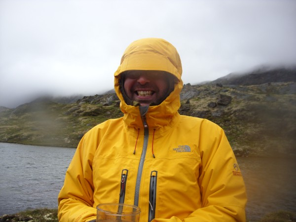

```{r setup-options, echo = FALSE, results = "hide", message = FALSE}
knitr::opts_chunk$set(comment=NA, fig.align = "center", out.width = "0.7\\linewidth",
                      echo = FALSE, message = FALSE, warning = FALSE, cache = TRUE)
knitr::knit_hooks$set(crop.plot = knitr::hook_pdfcrop)
```

# Introduction

## Who am I?

\columnsbegin
\column{0.6\linewidth}

- Ecologist & limnologist
    - Use palaeo as a tool
- Statistical ecologist
- Not an ecological statistician
- Used to teach the "ECRC Numerical Course" with John Birks
- Now a research scientist at IECS, U Regina
- Interested in
    - ecosystem response to environmental change
	- community dynamics
	- effects of N deposition on remote oligotrophic lakes
	- effects of nutrient enrichment on prarie lakes
	- C & N dynamics
	- statistical modelling

\column{0.4\linewidth}

{ width=100% }

\columnsend

## Philosophy

We want to use methods that are

- ecologically plausible
- simple without being too simple
- not unduly complex

John Birks' legacy on quantiative palaeoecology

Yet as a field we haven't moved with the times --- squandering John's legacy

What was simple / not too complex 20 years ago may not be the best "simple-non-complex" way now

As a field we are crap at training

## Reproducibility

Who here could reproduce the analyses for their

- terminal degree disertation?
- last paper?

For a worrying example, see Richard Telford's blog for his ongoing attempts to reproduce results from Lake Żabińskie (LaroqueTobler et al, 2015, *QSR* **111** 35--50)

[](https://quantpalaeo.wordpress.com/tag/larocque-tobler-et-al-2015/)

## Schedule

Lectures 0930--1200
Lunch 1200-1300
Computers 1300--you give up

- Monday
    - Intro to R
	- Linear models
- Tuesday
    - GLMs
	- GAMs
- Wednesday
    - Ordination
- Thursday
    - Stratigraphic data
	- Time series
- Friday
    - GLMMs
	- Requests from the audience

## Re-use

Copyright © (2017) Gavin L. Simpson Some Rights Reserved

Unless indicated otherwise, this slide deck is licensed under a [Creative Commons Attribution 4.0 International License](http://creativecommons.org/licenses/by/4.0/).

\begin{center}
  \ccby
\end{center}
