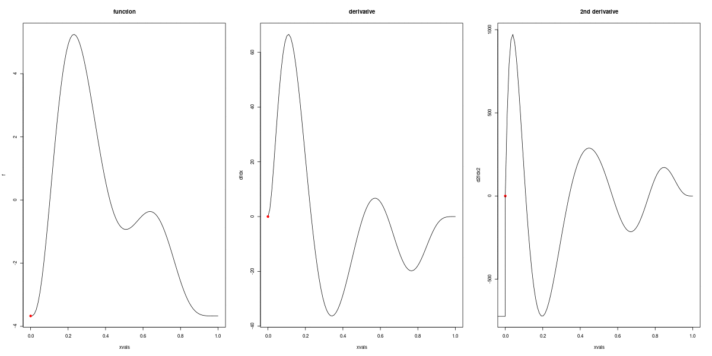

```{r setup-options, echo = FALSE, results = "hide", message = FALSE}
knitr::opts_chunk$set(comment=NA, prompt = TRUE, fig.align = "center", out.width = "0.7\\linewidth",
                      echo = TRUE, message = FALSE, warning = FALSE, cache = TRUE)
knitr::knit_hooks$set(crop.plot = knitr::hook_pdfcrop)
```

```{r packages, echo = FALSE, results = "hide", cache = FALSE}
library("knitr")
library("viridis")
library("ggplot2")
library("reshape2")
library("animation")
library("mgcv")
library("cowplot")
library("tidyr")
library("numDeriv")
theme_set(theme_bw())
```

# Generalized additive models

## Generalized additive models

\alert{Generalized additive models}

- Generalized --- conditions distribution of $y$ from (extended) exponential family of distributions
- Additive --- assume nothing more that separate model component sum
- Models --- it's a model

Earlier we looked at models that look like

$$
y_i = \beta_0 + \beta_1 x_{1i} + \beta_2 x_{2i} + \cdots + \varepsilon_i
$$

$\hat{y}_i$ is a linear combination of covariates

GLMs extend this model to allow $y_i$ to be distributed any member of the exponential family

Conditional distribution of $y_i | \mathbf{X}$

## Is this linear?

```{r islinear, fig.width=12, fig.height=6, echo=FALSE}
set.seed(2) ## simulate some data...
dat <- gamSim(1, n=400, dist="normal", scale=1, verbose=FALSE)
dat <- dat[,c("y", "x0", "x1", "x2", "x3")]
p <- ggplot(dat,aes(y=y,x=x1)) +
      geom_point()
p
```

## Is this linear? Maybe?

```{r eval=FALSE, echo=TRUE}
lm(y ~ x1, data=dat)
```

```{r maybe, fig.width=12, fig.height=6}
ggplot(dat, aes(y=y, x=x1)) + geom_point() +
    geom_smooth(method="lm")
```

## What can we do?

```{r eval=FALSE, echo=TRUE}
lm(y ~ x1 + poly(x1, 2), data=dat)
```

```{r quadratic, fig.width=12, fig.height=6}
ggplot(dat, aes(y=y, x=x1)) + geom_point() +
    geom_smooth(method="lm", formula = y~poly(x, 2))
```

## How practical is this?

- Adding in quadratic (and higher terms) *can* make sense
- This feels a bit *ad hoc*
- Better if we had a **framework** to deal with these issues?

```{r ruhroh, fig.width=12, fig.height=6}
ggplot(dat, aes(y=y, x=x2)) + geom_point() +
    geom_smooth(method="lm", formula = y~poly(x, 2))
```

## What does a GAM look like?

$$
y_i = \beta_0 + \sum_j s_j(x_{ji}) + \varepsilon_i
$$

where $\epsilon_i \sim N(0, \sigma^2)$, $y_i \sim \text{Normal}$ (for now)

Remember that we're modelling the mean of this distribution!

Call the above equation the **linear predictor**

## What are these $s_j$?

\columnsbegin

\column{0.5\linewidth}

- Think $s$ = **smooth**
- Want to model the covariates flexibly
- Covariates and response not necessarily linearly related!
- Want some "wiggles"

\column{0.5\linewidth}

```{r smoothdat, fig.width=8, fig.height=8, out.width="0.7\\linewidth"}
spdat <- melt(dat, id.vars = c("y"))
p <- ggplot(spdat,aes(y=y,x=value)) +
      geom_point() +
      facet_wrap(~variable, nrow=2)
print(p)
```

\columnsend

## What are these $s_j$?

\columnsbegin

\column{0.5\linewidth}

- Think $s$ = **smooth**
- Want to model the covariates flexibly
- Covariates and response not necessarily linearly related!
- Want some "wiggles"

\column{0.5\linewidth}

```{r wsmooths, fig.width=8, fig.height=8}
p <- p + geom_smooth()
print(p)
```

\columnsend

## Straight lines vs. interpolation

\columnsbegin
\column{0.55\linewidth}

- Want a line that is "close" to all the data
- Don't want interpolation -- we know there is "error"
- Balance between interpolation and "fit"


\column{0.45\linewidth}

```{r wiggles, fig.height=8, fig.width=8, echo=FALSE}
# hacked from the example in ?gam
set.seed(2) ## simulate some data... 
dat <- gamSim(1,n=50,dist="normal",scale=0.5, verbose=FALSE)
dat$y <- dat$f2 + rnorm(length(dat$f2), sd = sqrt(0.5))
f2 <- function(x) 0.2*x^11*(10*(1-x))^6+10*(10*x)^3*(1-x)^10-mean(dat$y)
ylim <- c(-4,6)

# fit some models
b.justright <- gam(y~s(x2),data=dat)
b.sp0 <- gam(y~s(x2, sp=0, k=50),data=dat)
b.spinf <- gam(y~s(x2),data=dat, sp=1e10)

curve(f2,0,1, col="blue", ylim=ylim)
points(dat$x2, dat$y-mean(dat$y))

```

\columnsend

## Splines

- Functions made of other, simpler functions
- **Basis functions** $b_k$, estimate $\beta_k$ 
- $s(x) = \sum_{k=1}^K \beta_k b_k(x)$
- Makes the math(s) much easier

```{r erics-spline-figure, fig.width = 15, fig.height = 4, out.width = "\\linewidth", echo=FALSE}
make_null_space_penalty = function(x){
  stopifnot(is.matrix(x))
  eigen_trans = eigen(x)
  vals = eigen_trans$values
  vecs = eigen_trans$vectors
  null_vec = ifelse(vals<1e-5,1,0)
  null_pen_matrix = vecs%*%diag(null_vec)%*%solve(vecs)
  null_pen_matrix = null_pen_matrix/abs(max(null_pen_matrix))
  return(null_pen_matrix)
  
}

k = 6
plotting_data = data.frame(x = seq(0,1,length=100))
plotting_data$y = rnorm(100, sin(2*pi*plotting_data$x),0.2)
cr_basis = smoothCon(s(x,bs="cr",k=k+1), data=plotting_data,
                     knots=NULL,absorb.cons=TRUE)[[1]]
tp_basis = smoothCon(s(x,bs="tp",k=k+1), data=plotting_data,
                     knots=NULL,absorb.cons=TRUE)[[1]]

#### Extract basis functions #### 
cr_basis_funcr = as.data.frame(cr_basis$X)
names(cr_basis_funcr) = paste("F",1:k, sep="")
cr_basis_funcr$x = plotting_data$x
cr_basis_funcr$model = "Cubic spline"

tp_basis_funcr = as.data.frame(tp_basis$X)
names(tp_basis_funcr) = paste("F",1:k, sep="")
tp_basis_funcr$x = plotting_data$x
tp_basis_funcr$model = "Thin plate spline"

spline_basis_funcr = rbind(cr_basis_funcr,tp_basis_funcr)
spline_basis_funcr = gather(spline_basis_funcr,func,value, -x,-model )

##### Extract penalty matrices ####
cr_basis_P = as.data.frame(cr_basis$S[[1]])
cr_basis_P = cr_basis_P/max(cr_basis_P)
names(cr_basis_P) = paste("F",1:k, sep="")
cr_basis_P$basis_y = factor(paste("F",1:k, sep=""), 
                            levels= rev(paste("F",1:k, sep="")))
cr_basis_P$model = "Cubic spline"

tp_basis_P = as.data.frame(tp_basis$S[[1]])
tp_basis_P = tp_basis_P/max(tp_basis_P)
names(tp_basis_P) = paste("F",1:k, sep="")
tp_basis_P$basis_y = factor(paste("F",1:k, sep=""), 
                            levels= rev(paste("F",1:k, sep="")))
tp_basis_P$model = "Thin plate spline"

spline_basis_penalties = rbind(cr_basis_P ,tp_basis_P )
spline_basis_penalties = gather(spline_basis_penalties,basis_x,value,
                                -basis_y,-model )

spline_basis_penalties$penalty_type = "Smoothness penalty"

##### Create null penalty matrices ####
cr_basis_NP = as.data.frame(make_null_space_penalty(cr_basis$S[[1]]))
names(cr_basis_NP) = paste("F",1:k, sep="")
cr_basis_NP$basis_y = factor(paste("F",1:k, sep=""), 
                            levels= rev(paste("F",1:k, sep="")))
cr_basis_NP$model = "Cubic spline"

tp_basis_NP = as.data.frame(make_null_space_penalty(tp_basis$S[[1]]))
names(tp_basis_NP) = paste("F",1:k, sep="")
tp_basis_NP$basis_y = factor(paste("F",1:k, sep=""), 
                            levels= rev(paste("F",1:k, sep="")))
tp_basis_NP$model = "Thin plate spline"

spline_null_penalties = rbind(cr_basis_NP ,tp_basis_NP )
spline_null_penalties = gather(spline_null_penalties,basis_x,value,
                                -basis_y,-model )


spline_null_penalties$penalty_type = "Null space penalty"

spline_penalties = rbind(spline_basis_penalties,spline_null_penalties)
spline_penalties$penalty = factor(spline_penalties$penalty, 
                                  levels = c("Smoothness penalty", "Null space penalty"))

#### Creating plots for smoothness and null-space penalties
basis_func_plot = ggplot(aes(x=x,y=value),data=spline_basis_funcr)+
  geom_line()+
  scale_x_continuous(breaks=seq(0,1,length=5),
                     labels=c("0","0.25","0.5","0.75","1"))+
  facet_grid(model~func, scales = "free_y")+
  theme_bw()+
  theme(strip.background = element_blank())

basis_penalty_plot = ggplot(aes(x=basis_x,y=basis_y,fill=value),
                            data=spline_penalties)+
  geom_tile(color="black")+
  facet_grid(model~penalty)+
  theme_bw()+
  scale_fill_gradient2("penalty",high = "#b2182b",low="#2166ac",midpoint = 0 )+
  theme(strip.background = element_blank())+
  labs(x="", y="")+
  coord_fixed()+
  scale_x_discrete(expand = c(0,0))+
  scale_y_discrete(expand = c(0,0))+
  theme(axis.ticks=element_blank(),
        panel.grid=element_blank())
  
plot_grid(basis_func_plot, basis_penalty_plot, ncol=2,
          rel_widths = c(1.5,1), labels = c("A","B"))
```

## Design matrices

We often write models as $X\boldsymbol{\beta}$

- $X$ is our data
- $\boldsymbol{\beta}$ are parameters we need to estimate

For a GAM it's the same

- $X$ has columns for each basis, evaluated at each observation
- again, this is the linear predictor

## Measuring wigglyness

Visually:

- Lots of wiggles == NOT SMOOTH
- Straight line == VERY SMOOTH

How do we do this mathematically?

- Derivatives!
- (Calculus *was* a useful class after all!)

## Wiggliness by derivatives

```{r wigglyanim, results="hide", echo=FALSE}
f2 <- function(x) 0.2*x^11*(10*(1-x))^6+10*(10*x)^3*(1-x)^10 - mean(dat$y)

xvals <- seq(0,1,len=100)

plot_wiggly <- function(f2, xvals){

  # pre-calculate
  f2v <- f2(xvals)
  f2vg <- grad(f2,xvals)
  f2vg2 <- unlist(lapply(xvals, hessian, func=f2))
  f2vg2min <- min(f2vg2) -2
  
  # now plot
  for(i in 1:length(xvals)){
    par(mfrow=c(1,3))
    plot(xvals, f2v, type="l", main="function", ylab="f")
    points(xvals[i], f2v[i], pch=19, col="red")
    
    plot(xvals, f2vg, type="l", main="derivative", ylab="df/dx")
    points(xvals[i], f2vg[i], pch=19, col="red")
    
    plot(xvals, f2vg2, type="l", main="2nd derivative", ylab="d2f/dx2")
    points(xvals[i], f2vg2[i], pch=19, col="red")
    polygon(x=c(0,xvals[1:i], xvals[i],f2vg2min),
            y=c(f2vg2min,f2vg2[1:i],f2vg2min,f2vg2min), col = "grey")
    
    ani.pause()
  }
}

saveGIF(plot_wiggly(f2, xvals), "wiggly.gif", interval = 0.2, ani.width = 1200, ani.height = 600)
```



## What was that grey bit?

$$
\int_\mathbb{R} \left( \frac{\partial^2 f(x)}{\partial^2 x}\right)^2 \text{d}x
$$

Take some derivatives of the smooth and integrate them over $x$

*Turns out* we can always write this as $\boldsymbol{\beta}^{\text{T}}S\boldsymbol{\beta}$, so the $\boldsymbol{\beta}$ is separate from the derivatives

Call $S$ the **penalty matrix**

## Making wigglyness matter

- $\boldsymbol{\beta}^\text{T}S\boldsymbol{\beta}$ measures wigglyness
- "Likelihood" measures closeness to the data
- Penalize closeness to the data...
- Use a **smoothing parameter** to decide on that trade-off...
  - $\lambda \beta^\text{T}S\beta$
- Estimate the $\beta_k$ terms but penalise objective
  - "closeness to data" + penalty

## Smoothing parameter

```{r wiggles-plot, fig.width=15, fig.height=6, out.width = "0.95\\linewidth", echo=FALSE}
# make three plots, w. estimated smooth, truth and data on each
par(mfrow=c(1,3), cex.main=3.5)

plot(b.justright, se=FALSE, ylim=ylim, main=expression(lambda*plain("= just right")))
points(dat$x2, dat$y-mean(dat$y))
curve(f2,0,1, col="blue", add=TRUE)

plot(b.sp0, se=FALSE, ylim=ylim, main=expression(lambda*plain("=")*0))
points(dat$x2, dat$y-mean(dat$y))
curve(f2,0,1, col="blue", add=TRUE)

plot(b.spinf, se=FALSE, ylim=ylim, main=expression(lambda*plain("=")*infinity)) 
points(dat$x2, dat$y-mean(dat$y))
curve(f2,0,1, col="blue", add=TRUE)

```

## Smoothing parameter selection

- Many methods: AIC, Mallow's $C_p$, GCV, ML, REML
- Recommendation, based on simulation and practice:
    - Use REML or ML
    - Reiss \& Ogden (2009), Wood (2011)
  


## Maximum wiggliness

- We can set **basis complexity** or "size" ($k$)
    - Maximum wigglyness
- Smooths have **effective degrees of freedom** (EDF)
- EDF < $k$
- Set $k$ "large enough"
    - Penalty does the rest

More on this in a bit...

## GAM summary

- Straight lines suck --- the world is not linear --- we want **wiggles**
- Use little functions (**basis functions**) to make big functions (**smooths**)
- Need to make sure your smooths are **wiggly enough**
- Use a **penalty** to trade off wiggliness/generality 

# Fitting GAMs in practice

## Translating maths into R

A simple example:

$$
y_i = \beta_0 + s(x) + s(w) + \epsilon_i
$$

where $\epsilon_i \sim N(0, \sigma^2)$

Let's pretend that $y_i \sim \text{Normal}$

- linear predictor: `formula = y ~ s(x) + s(w)`
- response distribution: `family = gaussian()`
- data: `data=some_data_frame` 

`method="REML"` uses REML for smoothness selection (default is `"GCV.Cp"`)

```{r echo=TRUE, eval=FALSE}
my_model <- gam(y ~ s(x) + s(w),
                family = gaussian(), data = some_data_frame,
                method = "REML")
```

# Checking the basis size

## How well does the model fit?

- Many choices: k, family, type of smoother, ...
- How do we assess how well our model fits?

## Example functions

```{r sims, include=TRUE, echo=TRUE}
set.seed(2)
n <-  400
x1 <-  rnorm(n)
x2 <- rnorm(n)
y_val <- 1 + 2 * cos(pi * x1) + 2 / (1 + exp(-5 * (x2)))
y_norm <- y_val + rnorm(n, 0, 0.5)
```

```{r sims_plot, fig.width=12, fig.height=5, out.width="0.8\\linewidth", fig.show="hold"}
layout(matrix(1:2, ncol=2))
plot(x1,y_norm); plot(x2,y_norm)
layout(1)
```

## Basis size (k)

- Set `k` per term
- e.g. `s(x, k=10)` or `s(x, y, k=100)`
- Penalty removes "extra" wigglyness
    - *up to a point!*
- But computation is slower with bigger `k`

## Checking basis size --- `gam.check()`

```{r gam_check_norm1, fig.keep="none", include=TRUE,echo=TRUE, fig.width=15,fig.align="center"}
norm_model_1 <- gam(y_norm ~ s(x1,k=4) + s(x2,k=4), method = "REML")
gam.check(norm_model_1)
```

## Checking basis size --- `gam.check()`

```{r gam_check_norm2, fig.keep="none", include=TRUE,echo=TRUE, fig.width=15, fig.align="center"}
norm_model_2 <- gam(y_norm ~ s(x1, k=12) + s(x2, k=4), method = "REML")
gam.check(norm_model_2)
```

## Checking basis size --- `gam.check()`

```{r gam_check_norm3, fig.keep="none", include=TRUE,echo=TRUE, fig.width=15,fig.align="center"}
norm_model_3 <- gam(y_norm~s(x1,k=12)+s(x2,k=12),method= "REML")
gam.check(norm_model_3)
```

## Checking basis size --- `gam.check()`

```{r gam_check_norm4, include=TRUE, echo=TRUE, fig.width=12, fig.height=7, fig.show="hold"}
layout(matrix(1:6,ncol=2, byrow = TRUE))
op <- par(mar = c(5,4,2,2) + 0.1)
plot(norm_model_1)
plot(norm_model_2)
plot(norm_model_3)
par(op)
layout(1)
```

# Model selection

## Overview

- Model selection
- Shrinkage smooths
- Shrinkage via double penalty (`select = TRUE`)
- Confidence intervals for smooths
- *p* values
- `anova()`
- AIC

```{r setup, include=FALSE, cache=FALSE}
library("knitr")
library("viridis")
library("ggplot2")
library("mgcv")
library("cowplot")
theme_set(theme_bw())
opts_chunk$set(cache=TRUE, echo=FALSE)
```

## Model selection

Model (or variable) selection --- and important area of theoretical and applied interest

- In statistics we aim for a balance between *fit* and *parsimony*
- In applied research we seek the set of covariates with strongest effects on $y$

We seek a subset of covariates that improves *interpretability* and *prediction accuracy*

# Shrinkage & additional penalties

## Shrinkage & additional penalties

Smoothing parameter estimation allows selection of a wide range of potentially complex functions for smooths...

But, cannot remove a term entirely from the model because the penalties used act only on the *range space* of a spline basis. The *null space* of the basis is unpenalized.

- **Null space** --- the basis functions that are smooth (constant, linear)
- **Range space** --- the basis functions that are wiggly

## Shrinkage & additional penalties

**mgcv** has two ways to penalize the null space, i.e. to do selection

- *double penalty approach* via `select = TRUE`
- *shrinkage approach* via special bases for thin plate and cubic splines

Other shrinkage/selection approaches are available

## Double-penalty shrinkage

$\mathbf{S}_j$ is the smoothing penalty matrix & can be decomposed as

$$
\mathbf{S}_j = \mathbf{U}_j\boldsymbol{\Lambda}_j\mathbf{U}_j^{T}
$$

where $\mathbf{U}_j$ is a matrix of eigenvectors and $\boldsymbol{\Lambda}_j$ a diagonal matrix of eigenvalues (i.e. this is an eigen decomposition of $\mathbf{S}_j$).

$\boldsymbol{\Lambda}_j$ contains some **0**s due to the spline basis null space --- no matter how large the penalty $\lambda_j$ might get no guarantee a smooth term will be suppressed completely.

To solve this we need an extra penalty...

## Double-penalty shrinkage

Create a second penalty matrix from $\mathbf{U}_j$, considering only the matrix of eigenvectors associated with the zero eigenvalues

$$
\mathbf{S}_j^{*} = \mathbf{U}_j^{*}\mathbf{U}_j^{*T}
$$

Now we can fit a GAM with two penalties of the form

$$
\lambda_j \mathbf{\beta}^T \mathbf{S}_j \mathbf{\beta} + \lambda_j^{*} \mathbf{\beta}^T \mathbf{S}_j^{*} \mathbf{\beta}
$$

Which implies two sets of penalties need to be estimated.

In practice, add `select = TRUE` to your `gam()` call

## Shrinkage

The double penalty approach requires twice as many smoothness parameters to be estimated. An alternative is the shrinkage approach, where $\mathbf{S}_j$ is replaced by


$$
\tilde{\mathbf{S}}_j = \mathbf{U}_j\tilde{\boldsymbol{\Lambda}}_j\mathbf{U}_j^{T}
$$

where $\tilde{\boldsymbol{\Lambda}}_j$ is as before except the zero eigenvalues are set to some small value $\epsilon$.

This allows the null space terms to be shrunk by the standard smoothing parameters.

Use `s(..., bs = "ts")` or `s(..., bs = "cs")` in **mgcv**

## Empirical Bayes...?

$\mathbf{S}_j$ can be viewed as prior precision matrices and $\lambda_j$ as improper Gaussian priors on the spline coefficients.

The impropriety derives from $\mathbf{S}_j$ not being of full rank (zeroes in $\boldsymbol{\Lambda}_j$).

Both the double penalty and shrinkage smooths remove the impropriety from the Gaussian prior

## Empirical Bayes...?

- **Double penalty** --- makes no assumption as to how much to shrink the null space. This is determined from the data via estimation of $\lambda_j^{*}$
- **Shrinkage smooths** --- assumes null space should be shrunk less than the wiggly part

Marra & Wood (2011) show that the double penalty and the shrinkage smooth approaches

- performed significantly better than alternatives in terms of *predictive ability*, and
- performed as well as alternatives in terms of variable selection

## Example

\columnsbegin
\column{0.6\linewidth}

```{r setup-shrinkage-example, echo = FALSE, include = FALSE}
## an example of automatic model selection via null space penalization
set.seed(3)
n <- 200
dat <- gamSim(1, n=n, scale=.15, dist="poisson")                ## simulate data
dat <- transform(dat, x4 = runif(n, 0, 1), x5 = runif(n, 0, 1)) ## spurious
b <- gam(y ~ s(x0) + s(x1) + s(x2) + s(x3) + s(x4) + s(x5), data = dat,
         family=poisson, select = TRUE, method = "REML")
#summary(b)
#plot(b, pages = 1)
```
```{r shrinkage-example-truth, fig.height = 8, fig.width=10, out.width="0.95\\linewidth"}
p1 <- ggplot(dat, aes(x = x0, y = f0)) + geom_line()
p2 <- ggplot(dat, aes(x = x1, y = f1)) + geom_line()
p3 <- ggplot(dat, aes(x = x2, y = f2)) + geom_line()
p4 <- ggplot(dat, aes(x = x3, y = f3)) + geom_line()
plot_grid(p1, p2, p3, p4, ncol = 2, align = "vh", labels = paste0("x", 1:4))
```

\column{0.4\linewidth}

- Simulate Poisson counts
- 4 known functions
- 2 spurious covariates

\columnsend

## Example

```{r shrinkage-example-summary}
summary(b)
```

## Example

```{r shrinkage-example-plot, fig.width = 16, fig.height = 9, out.width="0.9\\linewidth"}
plot(b, scheme = 1, pages = 1)
```

# Confidence intervals for smooths

## Confidence intervals for smooths

`plot.gam()` produces approximate 95% intervals (at +/- 2 SEs)

What do these intervals represent?

Nychka (1988) showed that standard Wahba/Silverman type Bayesian confidence intervals on smooths had good **across-the-function** frequentist coverage properties.

## Confidence intervals for smooths

Marra & Wood (2012) extended this theory to the generalized case and explain where the coverage properties failed:

*Must not over-smooth too much, which happens when $\lambda_j$ are over-estimated*

Two situations where this might occur

1. where true effect is almost in the penalty null space, $\hat{\lambda}_j \rightarrow \infty$
2. where $\hat{\lambda}_j$ difficult to estimate due to highly correlated covariates
    - if 2 correlated covariates have different amounts of wiggliness, estimated effects can have degree of smoothness *reversed*

## Don't over-smooth

> In summary, we have shown that Bayesian component-wise variable width intervals... for the smooth components of an additive model **should achieve close to nominal *across-the-function* coverage probability**, provided only that we do not over-smooth so heavily... Beyond this  requirement not to over-smooth too heavily, the results appear to have rather weak dependence on smoothing parameter values, suggesting that the neglect of smoothing parameter  variability  should  not  significantly  degrade  interval  performance.

## Confidence intervals for smooths

Marra & Wood (2012) suggested a solution to situation 1., namely true functions close to the penalty null space.

Smooths are normally subject to *identifiability* constraints (centred), which leads to zero variance where the estimated function crosses the zero line.

Instead, compute intervals for $j$ th smooth as if it alone had the intercept; identifiability constraints go on the other smooth terms.

Use `seWithMean = TRUE` in call to `plot.gam()`

## Example

```{r setup-confint-example, fig = TRUE, fig.width = 11, fig.height = 10, results = "hide", echo=FALSE}
library(mgcv)
set.seed(0)
## fake some data...
f1 <- function(x) {exp(2 * x)}
f2 <- function(x) { 
  0.2*x^11*(10*(1-x))^6+10*(10*x)^3*(1-x)^10 
}
f3 <- function(x) {x*0}

n<-200
sig2 <- 12
x0 <- rep(1:4,50)
x1 <- runif(n, 0, 1)
x2 <- runif(n, 0, 1)
x3 <- runif(n, 0, 1)
e <- rnorm(n, 0, sqrt(sig2))
y <- 2*x0 + f1(x1) + f2(x2) + f3(x3) + e
x0 <- factor(x0)

## fit and plot...
b <- gam(y ~ x0 + s(x1) + s(x2) + s(x3))

op <- par(mar = c(4,4,1,1) + 0.1)
layout(matrix(1:9, ncol = 3, byrow = TRUE))
curve(f1)
curve(f2)
curve(f3)
plot(b, shade=TRUE)
plot(b, shade = TRUE, seWithMean = TRUE) ## better coverage intervals
layout(1)
par(op)
```

# p values for smooths

## p values for smooths

...are approximate:

1. they don't really account for the estimation of $\lambda_j$ --- treated as known
2. rely on asymptotic behaviour --- they tend towards being right as sample size tends to $\infty$

Also, *p* values in `summary.gam()` have changed a lot over time --- all options except current default are deprecated as of `v1.18-13`.

The approach described in Wood (2006) is "*no longer recommended*"!

## p values for smooths

...are a test of **zero-effect** of a smooth term

Default *p* values rely on theory of Nychka (1988) and Marra & Wood (2012) for confidence interval coverage.

If the Bayesian CI have good across-the-function properties, Wood (2013a) showed that the *p* values have

- almost the correct null distribution
- reasonable power

Test statistic is a form of $\chi^2$ statistic, but with complicated degrees of freedom.

## p values for unpenalized smooths

The results of Nychka (1988) and Marra & Wood (2012) break down if smooth terms are unpenalized.

This include i.i.d. Gaussian random effects, (e.g. `bs = "re"`)

Wood (2013b) proposed instead a test based on a likelihood ratio statistic:

- the reference distribution used is appropriate for testing a $\mathrm{H}_0$ on the boundary of the allowed parameter space...
- ...in other words, it corrects for a $\mathrm{H}_0$ that a variance term is zero.

## p values for smooths

Have the best behaviour when smoothness selection is done using **ML**, then **REML**.

Neither of these are the default, so remember to use `method = "ML"` or `method = "REML"` as appropriate

## p values for parametric terms

...are based on Wald statistics using the Bayesian covariance matrix for the coefficients.

This is the "right thing to do" when there are random effects terms present and doesn't really affect performance if there aren't.

Hence in most instances you won't need to change the default `freq = FALSE` in `summary.gam()`

# anova()

## anova()

**mgcv** provides an `anova()` method for `"gam"` objects:

1. Single model form: `anova(m1)`
2. Multiple model form: `anova(m1, m2, m3)`

## anova() --- single model form

This differs from `anova()` methods for `"lm"` or `"glm"` objects:

- the tests are Wald-like tests as described for `summary.gam()` of a $\mathrm{H}_0$ of zero-effect of a smooth term
- these are not *sequential* tests!

## anova()

```{r anova-example-single, echo = TRUE}
b1 <- gam(y ~ x0 + s(x1) + s(x2) + s(x3), method = "REML")
anova(b1)
```

## anova() --- multi model form

The multi-model form should really be used with care --- the *p* values are really *approximate*

For *general smooths* deviance is replaced by $-2\mathcal{L}(\hat{\beta})$

```{r anova-example-multi, echo = TRUE}
b1 <- gam(y ~ s(x0) + s(x1) + s(x2) + s(x3) + s(x4) + s(x5), data = dat,
          family=poisson, method = "ML")
b2 <- update(b1, . ~ . - s(x3) - s(x4) - s(x5))
anova(b2, b1, test = "LRT")
```

# AIC for GAMs

## AIC for GAMs

- Comparison of GAMs by a form of AIC is an alternative frequentist approach to model selection
- Rather than using the marginal likelihood, the likelihood of the $\mathbf{\beta}_j$ *conditional* upon $\lambda_j$ is used, with the EDF replacing $k$, the number of model parameters
- This *conditional* AIC tends to select complex models, especially those with random effects, as the EDF ignores that $\lambda_j$ are estimated
- Wood et al (2015) suggests a correction that accounts for uncertainty in $\lambda_j$

$$
AIC = -2l(\hat{\beta}) + 2\mathrm{tr}(\widehat{\mathcal{I}}V^{'}_{\beta})
$$

## AIC

In this example, $x_3$, $x_4$, and $x_5$ have no effects on $y$

```{r aic-example, echo = TRUE}
AIC(b1, b2)
```

## References

- [Marra & Wood (2011) *Computational Statistics and Data Analysis* **55** 2372--2387.](http://doi.org/10.1016/j.csda.2011.02.004)
- [Marra & Wood (2012) *Scandinavian journal of statistics, theory and applications* **39**(1), 53--74.](http://doi.org/10.1111/j.1467-9469.2011.00760.x.)
- [Nychka (1988) *Journal of the American Statistical Association* **83**(404) 1134--1143.](http://doi.org/10.1080/01621459.1988.10478711)
- Wood (2006) *Generalized Additive Models: An Introduction with R*. Chapman and Hall/CRC.
- [Wood (2013a) *Biometrika* **100**(1) 221--228.](http://doi.org/10.1093/biomet/ass048)
- [Wood (2013b) *Biometrika* **100**(4) 1005--1010.](http://doi.org/10.1093/biomet/ast038)

## Re-use

Copyright © (2017) Gavin L. Simpson Some Rights Reserved

Unless indicated otherwise, this slide deck is licensed under a [Creative Commons Attribution 4.0 International License](http://creativecommons.org/licenses/by/4.0/).

\begin{center}
  \ccby
\end{center}
